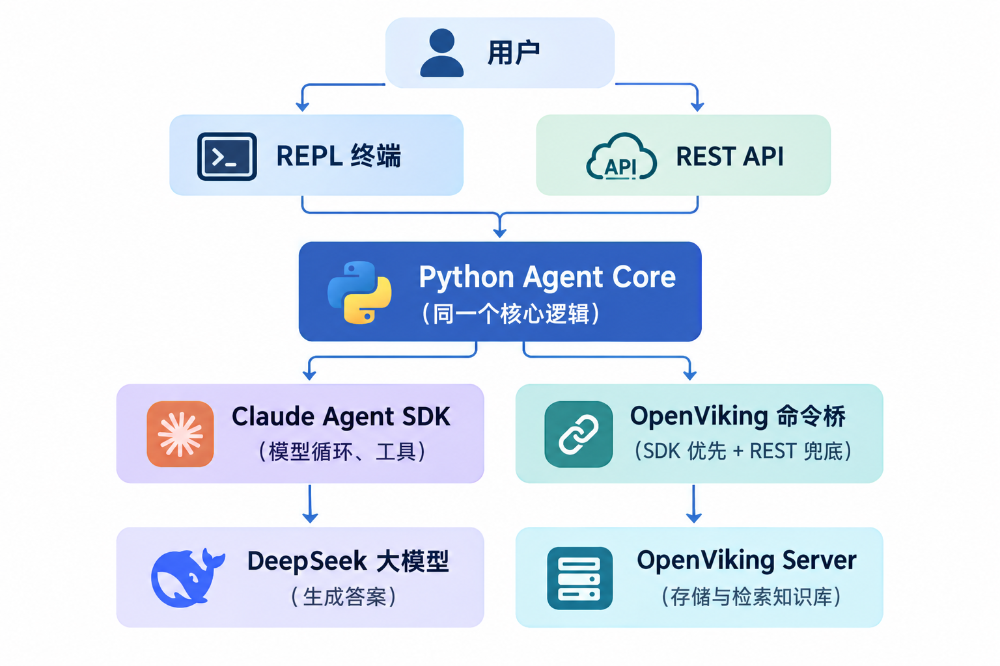

# Agentic RAG Assistant

一个中文知识库问答助手：你把文档交给它，它**只根据这些文档**回答问题，并在答案里附上可追溯的引用（`viking://...`）。知识库里没有的问题，它会明确拒答，而不是编造。

> 这份 README 面向懂一点 AI 概念（知道"大模型""API"是什么）的初级开发者和产品经理。不需要预先了解 RAG、MCP 或 Agent，正文会边用边解释。

## 它解决什么问题

直接问大模型"我们 AURORA-LX-9001 的标配电池容量是多少"，它不可能答对——模型没见过你的内部资料，硬答就是**幻觉**（一本正经地编造）。

这个项目用 **RAG（Retrieval-Augmented Generation，检索增强生成）**解决：

```text
普通 AI 聊天：  你的问题 ──► 大模型 ────────────► 答案（可能编造）
本项目（RAG）： 你的问题 ──► 先检索知识库 ──► 大模型只依据检索结果作答 ──► 答案 + 引用
```

一句话总结：**先查资料、再回答、附出处、查不到就说不知道。**

## 两种使用方式

| 入口 | 适合谁 | 说明 |
|---|---|---|
| **REPL**（终端聊天） | 想马上试用的人 | 在命令行里像聊天一样提问 |
| **REST API** | 开发者 | HTTP 调用，答案以 SSE（服务器推送事件）流式返回 |

两种入口共享同一个 Agent Core（核心逻辑）和 SQLite 会话存储，行为一致：聊过的会话在服务重启后还能继续。

## 它是怎么工作的



三个外部角色，用图书馆打比方：

| 组件 | 作用 | 类比 |
|---|---|---|
| OpenViking Server | 独立的知识存储与检索服务 | 图书馆：书架 + 检索系统 |
| DeepSeek API | 生成答案的大模型 | 拿着资料写总结的人 |
| Claude Agent SDK | 决定"什么时候检索、怎么调工具"的编排层 | 带着问题去图书馆的助理 |

几个关键设计：

- **OpenViking Server 是独立进程**，本服务只连接它、不管理它，所以要先启动它（见快速开始第 2 步）。
- 问答走 OpenViking 原生 `/mcp` 端点（MCP = Model Context Protocol，模型调用外部工具的标准协议），不额外自建 MCP server。
- Claude Agent SDK 负责模型循环、工具调用、会话存储接入和 runtime 生命周期：Python Agent SDK 会监管 Claude runtime 子进程（stdio 通信）——本项目不是简单包一层 DeepSeek API。
- REST 默认只监听 `127.0.0.1`（本机）；密钥只从本地 `.env` 读取，调用方无法传入供应商密钥。

## 快速开始

### 准备

- Windows + Python 3.11
- 一个 [DeepSeek API Key](https://platform.deepseek.com)（真实问答必需）
- [Ollama](https://ollama.com) 已安装，并拉取检索用的 embedding 模型：

```powershell
ollama pull qwen3-embedding:0.6b
```

> embedding 模型选择与向量索引配置是外部 OpenViking/Ollama 运行环境的前置条件（通过 `agentic-rag-ov.conf` 交给 OpenViking Server），不属于本应用的管理范围；本应用只连接已经配置好的 OpenViking Server，不托管这类配置。

克隆仓库后先创建虚拟环境并安装锁定依赖（只需一次）：

```powershell
python -m venv .venv
.\.venv\Scripts\python.exe -m pip install -r requirements.txt
```

### 第 1 步：配置 `.env`

复制 `.env.example` 为 `.env`，填入你的 DeepSeek Key：

```dotenv
DEEPSEEK_API_KEY=你的密钥
```

其余变量保持默认即可。**不要把 `.env` 和真实密钥提交到仓库。**

### 第 2 步：启动 OpenViking Server（新开一个终端）

```powershell
cd D:\project\Harness\python-claude-sdk

.\.venv\Scripts\openviking-server.exe `
  --config=D:\project\Harness\python-claude-sdk\agentic-rag-ov.conf `
  --host=127.0.0.1 `
  --port=1933 `
  --workers=1
```

看到 `OpenViking HTTP Server is running on 127.0.0.1:1933` 就成功了。这个终端要保持开着。

### 第 3 步：启动本服务（再开一个终端）

```powershell
# REST API 方式（默认）
.\.venv\Scripts\python.exe -m agentic_rag serve

# 或者：REPL 终端聊天方式
.\.venv\Scripts\python.exe -m agentic_rag repl
```

所有命令都必须使用仓库虚拟环境中的 Python（如上所示，即 `python -m agentic_rag serve` 与 `python -m agentic_rag repl`，Windows 上通过 `.\.venv\Scripts\python.exe` 调用）。REPL 支持 `/new`（新会话）、`/session <session-id>`（切换会话）、`/current`（查看当前会话）、`/clear`（清屏）、`/exit`（退出）。

### 第 4 步：上传示例文档

示例文档在 `samples/` 目录。先建立隔离的示例知识库目录，再上传文档（curl 示例假设服务在 `127.0.0.1:8000`；上传另外两份文档时替换文件名即可）：

```bash
# 建立隔离的示例知识库目录
curl -sS -X POST http://127.0.0.1:8000/commands/execute \
  -H 'Content-Type: application/json' \
  --data '{"command":"mkdir","arguments":{"uri":"viking://resources/agentic-rag-demo"}}'

# 上传第一份示例文档
curl -sS -X POST http://127.0.0.1:8000/commands/execute \
  -F 'command=add-resource' \
  -F 'arguments_json={"parent":"viking://resources/agentic-rag-demo"}' \
  -F 'file=@samples/01-product-facts.md;type=text/markdown'
```

> Windows PowerShell 用户：请用 `curl.exe` 代替 `curl`（`curl` 在 PowerShell 里是 `Invoke-WebRequest` 的别名）。示例中的单引号写法在 PowerShell 中可直接使用。

### 第 5 步：提问

REST 方式（答案以 SSE 事件流返回，其中 `text_delta` 是答案文本，`citation` 是引用，`done` 表示结束并汇总引用）：

```bash
curl -N -X POST http://127.0.0.1:8000/qa/stream \
  -H 'Content-Type: application/json' \
  --data '{"message":"AURORA-LX-9001 的标配电池容量是多少？","target_uri":"viking://resources/agentic-rag-demo"}'
```

REPL 方式：启动后直接输入问题即可。

## 验证效果：三个必试问题

示例知识库有三份中文文档，固定上传到隔离的 Demo 命名空间 `viking://resources/agentic-rag-demo`，不会污染其他数据：

| 文件 | 内容 |
|---|---|
| `samples/01-product-facts.md` | AURORA-LX-9001 产品事实与适用范围 |
| `samples/02-operations-runbook.md` | 运维手册（索引并发、熔断、一致性检查等） |
| `samples/03-research-conclusions.md` | 调研结论与显式适用限制 |

依次问这三个问题，可以完整看到"检索、综合、拒答"三种行为：

1. **单文档事实检索**：`AURORA-LX-9001 的标配电池容量是多少？` → 应给出带引用的准确答案
2. **跨文档综合**：`结合产品、运维和研究三份文档，AURORA-LX-9001 的电池容量、索引并发上限与调研适用边界是什么？` → 应综合三处来源
3. **应该拒答**：`AGENTIC-RAG-DEMO-NO-SUCH-CLAIM-9931 是什么？` → 应明确拒绝，而不是编造

有依据的回答必须给出 OpenViking `viking://` 引用；知识库不支持的问题应明确拒绝，不得为"缺失本身"伪造引用。

样例数据默认保留在 Demo 命名空间 `viking://resources/agentic-rag-demo` 中，便于随时复验。需要清理时执行下面的命令（删除后应轮询返回的 job 确认 OpenViking 删除完成）：

```bash
curl -sS -X POST http://127.0.0.1:8000/commands/execute \
  -H 'Content-Type: application/json' \
  --data '{"command":"rm","arguments":{"uri":"viking://resources/agentic-rag-demo","recursive":true}}'
```

## REST API 速览

应用自身端点：

| 方法与路径 | 用途 |
|---|---|
| `GET /health` | 健康检查；OpenViking 未启动时返回 503 |
| `GET /commands` | 返回完整 CLI Semantic Command 清单 |
| `GET /sessions` | 列出持久化会话 |
| `GET /sessions/{session_id}` | 读取会话摘要与记录 |
| `DELETE /sessions/{session_id}` | 删除指定会话 |
| `POST /qa/stream` | SSE 流式问答 |
| `POST /commands/execute` | JSON 或 multipart 通用命令执行 |
| `GET /jobs/{job_id}` | 查询长任务状态 |

FastAPI 还自动提供交互式 API 文档：浏览器打开 `http://127.0.0.1:8000/docs`（Swagger UI）或 `/redoc` 即可试用。

### SSE 事件契约

SSE 的 `event:` 名称与 payload `type` 总是相同。所有事件都包含：

| 公共字段 | 类型 | 说明 |
|---|---|---|
| `type` | string | 与 SSE event 名称相同 |
| `request_id` | string | 本次请求标识 |
| `session_id` | string | 稳定会话 UUID；缺失时由应用生成 |
| `timestamp` | string | UTC ISO-8601 时间 |

| Event / `type` | 额外字段 | 说明 |
|---|---|---|
| `message_start` | 无 | 会话锁取得并开始处理 |
| `thinking_delta` | `text: string` | 模型思考增量，与答案分离 |
| `tool_call` | `tool_call_id: string`, `tool_name: string`, `arguments: object` | OpenViking 工具调用与脱敏参数摘要 |
| `tool_result` | `tool_call_id: string`, `tool_name: string`, `error: boolean`, `content: any` | 工具结果；不是答案文本 |
| `citation` | `citation: string` | 首次发现的规范化 `viking://` 引用 |
| `text_delta` | `text: string` | 答案文本增量；可能继续触发 citation |
| `done` | `citations: string[]` | 成功终态与去重后的聚合引用 |
| `error` | `code: string`, `message: string` | 终态错误；之后不会再补发 `done` |

## 环境变量

复制 `.env.example` 为 `.env` 后填写：

| 变量 | 必填 | 默认值 | 含义 |
|---|---|---|---|
| `HOST` | 否 | `127.0.0.1` | REST 绑定地址；默认只监听本机 |
| `PORT` | 否 | `8000` | REST 端口 |
| `OPENVIKING_BASE_URL` | 是 | `http://127.0.0.1:1933` | OpenViking Server 基础地址 |
| `OPENVIKING_API_KEY` | 视 Server 模式 | 空 | OpenViking `X-API-Key`；本地免认证模式可为空 |
| `DEEPSEEK_BASE_URL` | 是 | `https://api.deepseek.com/anthropic` | DeepSeek Anthropic 兼容接口 |
| `DEEPSEEK_API_KEY` | 真实问答必填 | 空 | 只放在进程环境或本地 `.env`，不写入日志 |
| `DEEPSEEK_MODEL` | 否 | `deepseek-flash` | DeepSeek 模型名 |
| `SESSION_DATABASE_PATH` | 否 | `data/sessions.sqlite3` | 会话与任务 SQLite 路径 |

## 命令目录

`POST /commands/execute` 桥接 OpenViking 的全部 CLI Semantic Command（下表由 `agentic_rag/command_manifest.json` 生成，与 `GET /commands` 返回的目录一致；启动时还会对照运行中的 OpenViking OpenAPI 校验，实质漂移会拒绝启动）。长任务语义详见 [docs/commands.md](docs/commands.md)。

| # | 命令 | Transport | 执行模式 | 文件输入 | 风险 | 说明 |
|---:|---|---|---|---|---|---|
| 1 | `health` | sdk | 同步 | 无 | 只读 | Run a quick server reachability check. |
| 2 | `status` | sdk | 同步 | 无 | 只读 | Show OpenViking server readiness and component status. |
| 3 | `find` | sdk | 同步 | 无 | 只读 | Retrieve relevant OpenViking context semantically. |
| 4 | `read` | sdk | 同步 | 无 | 只读 | Read exact Level 2 file content from a Viking URI. |
| 5 | `write` | sdk | OpenViking 原生异步 | 无 | 变更 | Update text content in an existing resource. |
| 6 | `add-resource` | sdk | OpenViking 原生异步 | 可选上传 | 变更 | Import a local file, folder, URL, repository, or whole website (sitemap/RSS) into OpenViking. |
| 7 | `add-skill` | sdk | OpenViking 原生异步 | 可选上传 | 变更 | Import a skill directory, SKILL.md file, or raw skill content. |
| 8 | `add-memory` | rest_fallback | OpenViking 原生异步 | 无 | 变更 | Add a memory directly from text or JSON messages. |
| 9 | `set-tags` | sdk | OpenViking 原生异步 | 无 | 变更 | Update explicit retrieval tags for a file or directory. |
| 10 | `ls` | sdk | 同步 | 无 | 只读 | List resources under a Viking URI. |
| 11 | `tree` | sdk | 同步 | 无 | 只读 | Show a hierarchical view of resources under a URI. |
| 12 | `mkdir` | sdk | 同步 | 无 | 变更 | Create a directory in OpenViking. |
| 13 | `rm` | sdk | OpenViking 原生异步 | 无 | 破坏性 | Remove a resource from OpenViking. |
| 14 | `cp` | rest_fallback | 同步 | 无 | 变更 | Copy a file or directory without reparsing or regenerating vectors. |
| 15 | `mv` | sdk | 同步 | 无 | 变更 | Move or rename a resource. |
| 16 | `stat` | sdk | 同步 | 无 | 只读 | Show metadata for one resource. |
| 17 | `attrs get` | rest_fallback | 同步 | 无 | 只读 | Get or update logical extended attributes for a resource. |
| 18 | `attrs set-tags` | sdk | OpenViking 原生异步 | 无 | 变更 | Get or update logical extended attributes for a resource. |
| 19 | `get` | sdk | 同步 | 输出文件 | 只读 | Download a file resource to a local path. |
| 20 | `search` | sdk | 同步 | 无 | 只读 | Run experimental context-aware retrieval, optionally scoped to a session. |
| 21 | `grep` | sdk | 同步 | 无 | 只读 | Search resource content with a text pattern. |
| 22 | `glob` | sdk | 同步 | 无 | 只读 | Find resources by glob pattern. |
| 23 | `abstract` | rest_fallback | 同步 | 无 | 只读 | Read Level 0 abstract content for a directory. |
| 24 | `overview` | sdk | 同步 | 无 | 只读 | Read Level 1 overview content for a directory. |
| 25 | `wait` | sdk | 本地后台等待 | 无 | 只读 | Wait for queued async processing to complete. |
| 26 | `reindex` | sdk | OpenViking 原生异步 | 无 | 变更 | Reindex semantic/vector artifacts for a URI. |
| 27 | `import` | sdk | OpenViking 原生异步 | 必须上传 | 变更 | Import an .ovpack into a target URI. |
| 28 | `export` | sdk | 本地长任务 | 输出文件 | 只读 | Export context from a URI as an .ovpack file. |
| 29 | `backup` | sdk | 本地长任务 | 输出文件 | 只读 | Create a restore-only backup .ovpack for public OpenViking scopes. |
| 30 | `restore` | sdk | OpenViking 原生异步 | 必须上传 | 变更 | Restore a backup .ovpack to its original public scope roots. |
| 31 | `chat` | rest_fallback | 同步 | 无 | 变更 | Chat with the vikingbot agent. |
| 32 | `compile` | rest_fallback | OpenViking 原生异步 | 无 | 变更 | Use a required VikingBot Skill to compile OpenViking materials into Wiki pages or a Skill package. |
| 33 | `skills add` | sdk | OpenViking 原生异步 | 可选上传 | 变更 | Add skills from a source |
| 34 | `skills list` | sdk | 同步 | 无 | 只读 | List installed agent skills |
| 35 | `skills find` | sdk | 同步 | 无 | 只读 | Find installed agent skills semantically |
| 36 | `skills show` | sdk | 同步 | 无 | 只读 | Show one installed skill |
| 37 | `skills update` | sdk | OpenViking 原生异步 | 可选上传 | 变更 | Update installed skills from their recorded source |
| 38 | `skills remove` | sdk | 同步 | 无 | 破坏性 | Remove installed skills |
| 39 | `skills validate` | sdk | 同步 | 可选上传 | 只读 | Validate a local SKILL.md file or skill directory |
| 40 | `acl get` | sdk | 同步 | 无 | 只读 | Get or update access permissions for a resource.: get |
| 41 | `acl set` | sdk | 同步 | 无 | 变更 | Get or update access permissions for a resource.: set |
| 42 | `acl grant` | sdk | 同步 | 无 | 变更 | Get or update access permissions for a resource.: grant |
| 43 | `acl revoke` | sdk | 同步 | 无 | 变更 | Get or update access permissions for a resource.: revoke |
| 44 | `acl rm` | sdk | 同步 | 无 | 破坏性 | Get or update access permissions for a resource.: rm |
| 45 | `task status` | sdk | 同步 | 无 | 只读 | Show status of a specific task |
| 46 | `task cancel` | sdk | 同步 | 无 | 破坏性 | Cancel a task |
| 47 | `task list` | sdk | 同步 | 无 | 只读 | List all tracked tasks |
| 48 | `task watch ls` | sdk | 同步 | 无 | 只读 | List watch tasks (auto-refresh subscriptions) |
| 49 | `task watch show` | sdk | 同步 | 无 | 只读 | Show details of a single watch task |
| 50 | `task watch rm` | sdk | 同步 | 无 | 破坏性 | Delete a watch task |
| 51 | `task watch pause` | rest_fallback | 同步 | 无 | 变更 | Pause a watch task (preserves cadence, stops scheduling) |
| 52 | `task watch resume` | rest_fallback | 同步 | 无 | 变更 | Resume a paused watch task |
| 53 | `task watch update` | sdk | 同步 | 无 | 变更 | Update one or more mutable fields of a watch task. At least one flag is required |
| 54 | `task watch trigger` | sdk | 同步 | 无 | 变更 | Trigger an immediate refresh, bypassing the schedule |
| 55 | `session new` | sdk | 同步 | 无 | 变更 | Create a new session |
| 56 | `session list` | sdk | 同步 | 无 | 只读 | List sessions |
| 57 | `session get` | sdk | 同步 | 无 | 只读 | Get session details |
| 58 | `session get-session-context` | sdk | 同步 | 无 | 只读 | Get full merged session context |
| 59 | `session get-session-archive` | sdk | 同步 | 无 | 只读 | Get one completed archive for a session |
| 60 | `session delete` | sdk | 同步 | 无 | 破坏性 | Delete a session |
| 61 | `session add-message` | sdk | 同步 | 无 | 变更 | Add one message to a session |
| 62 | `session add-messages` | sdk | 同步 | 无 | 变更 | Add multiple messages to a session |
| 63 | `session config set` | sdk | 同步 | 无 | 变更 | Set mutable session configuration |
| 64 | `session commit` | sdk | OpenViking 原生异步 | 无 | 变更 | Commit a session (archive messages and extract memories) |
| 65 | `snapshot commit` | sdk | 同步 | 无 | 变更 | Commit the current workspace state as a new snapshot. |
| 66 | `snapshot restore` | sdk | 同步 | 无 | 破坏性 | Restore a project directory to a past snapshot via a forward commit. |
| 67 | `snapshot show` | sdk | 同步 | 无 | 只读 | Show a commit's metadata, or a single blob at a path. |
| 68 | `snapshot log` | sdk | 同步 | 无 | 只读 | Walk commit history for a branch, newest first. |
| 69 | `snapshot diff` | sdk | 同步 | 无 | 只读 | Compare one file between two snapshots as a unified diff. |
| 70 | `snapshot ignore-get` | sdk | 同步 | 无 | 只读 | Show the account-level .ovgitignore content. |
| 71 | `snapshot ignore-set` | sdk | 同步 | 无 | 变更 | Set the account-level .ovgitignore content (overwrites). |
| 72 | `snapshot ignore-delete` | sdk | 同步 | 无 | 破坏性 | Delete the account-level .ovgitignore file (idempotent). |
| 73 | `privacy categories` | rest_fallback | 同步 | 无 | 只读 | List privacy config categories |
| 74 | `privacy list` | rest_fallback | 同步 | 无 | 只读 | List targets by category |
| 75 | `privacy get` | rest_fallback | 同步 | 无 | 只读 | Get current active config for target |
| 76 | `privacy upsert` | rest_fallback | 同步 | 无 | 变更 | Upsert privacy config values |
| 77 | `privacy versions` | rest_fallback | 同步 | 无 | 只读 | List versions for target |
| 78 | `privacy version` | rest_fallback | 同步 | 无 | 只读 | Get one version by number |
| 79 | `privacy activate` | rest_fallback | 同步 | 无 | 变更 | Activate a version |
| 80 | `admin create-account` | sdk | 同步 | 无 | 特权 | Create a new account with its first admin user |
| 81 | `admin list-accounts` | sdk | 同步 | 无 | 特权 | List all accounts (ROOT only) |
| 82 | `admin delete-account` | sdk | 同步 | 无 | 特权 | Delete an account and all associated users (ROOT only) |
| 83 | `admin migrate` | sdk | OpenViking 原生异步 | 无 | 特权 | Migrate legacy agent/session data to user-owned namespaces (ROOT only) |
| 84 | `admin register-user` | sdk | 同步 | 无 | 特权 | Register a new user in an account |
| 85 | `admin list-users` | sdk | 同步 | 无 | 特权 | List all users in an account |
| 86 | `admin create-group` | sdk | 同步 | 无 | 特权 | Create an empty account-scoped group |
| 87 | `admin list-groups` | sdk | 同步 | 无 | 特权 | List groups in an account |
| 88 | `admin list-group-members` | sdk | 同步 | 无 | 特权 | List the users in a group |
| 89 | `admin add-group-member` | sdk | 同步 | 无 | 特权 | Add an existing account user to a group |
| 90 | `admin remove-group-member` | sdk | 同步 | 无 | 特权 | Remove a user from a group |
| 91 | `admin delete-group` | sdk | 同步 | 无 | 特权 | Delete an empty group |
| 92 | `admin remove-user` | sdk | 同步 | 无 | 特权 | Remove a user from an account |
| 93 | `admin set-role` | sdk | 同步 | 无 | 特权 | Change a user's role (ROOT only) |
| 94 | `admin regenerate-key` | sdk | 同步 | 无 | 特权 | Regenerate a user's API key (old key immediately invalidated) |
| 95 | `admin set-account-settings` | rest_fallback | 同步 | 无 | 特权 | Update allowlisted settings for an account |
| 96 | `observer queue` | rest_fallback | 同步 | 无 | 只读 | Get queue status |
| 97 | `observer vikingdb` | rest_fallback | 同步 | 无 | 只读 | Get VikingDB status |
| 98 | `observer models` | rest_fallback | 同步 | 无 | 只读 | Get models status (VLM, Embedding, Rerank) |
| 99 | `observer retrieval` | rest_fallback | 同步 | 无 | 只读 | Get retrieval quality metrics |
| 100 | `observer filesystem` | rest_fallback | 同步 | 无 | 只读 | Get filesystem operation metrics |
| 101 | `observer system` | rest_fallback | 同步 | 无 | 只读 | Get overall system status |
| 102 | `system wait` | sdk | 本地后台等待 | 无 | 只读 | Wait for queued async processing to complete |
| 103 | `system status` | sdk | 同步 | 无 | 只读 | Show component status |
| 104 | `system health` | sdk | 同步 | 无 | 只读 | Quick health check |
| 105 | `system consistency` | sdk | 同步 | 无 | 只读 | Check filesystem and vector-index consistency for a URI subtree |
| 106 | `system backend sync-status` | rest_fallback | 同步 | 无 | 只读 | Show multi-write backend sync status for a URI subtree |
| 107 | `system backend sync-retry` | rest_fallback | 同步 | 无 | 变更 | Retry pending multi-write backend sync work for a URI subtree |

长任务要点：

- 只读命令同步返回统一 envelope；长耗时命令立即返回 job，再用 GET /jobs/{job_id} 轮询。
- job 状态为 queued / running / succeeded / failed / interrupted。
- 本地任务重启后会被标记为 interrupted（错误码 JOB_INTERRUPTED）；保留 OpenViking native task ID 的 job 会继续向 Server 对账权威状态。

## 安全须知

- REST 默认只绑定 `127.0.0.1`，不要随意改成 `0.0.0.0` 暴露到外网。
- API 密钥只放在本地 `.env` 或进程环境变量，不写入代码、日志或 git。
- `rm` 是破坏性命令。清理示例数据时，删除整个 `viking://resources/agentic-rag-demo` 即可，删除后应轮询返回的 job 确认 OpenViking 删除完成。
- 不要删除仓库中的 `data/` 目录来"清理示例"：SQLite 和默认 OpenViking 数据是运行时状态。

## 版本与依赖说明

最终验证时安装的是 OpenViking 0.4.19（其 Server 的 `/mcp` 端点动态提供十五个 MCP 工具）与 `openviking-sdk` 0.1.10。OpenViking 在线文档可能落后于安装包；**遇到文档与实际不一致，以本机已安装包和正在运行的 Server/OpenAPI 为准**。

主要依赖（版本已锁定在 `requirements.txt`，按快速开始的步骤创建环境后即可运行；下表与锁定清单一致）：

| 依赖 | 验证版本 | 大白话用途 |
|---|---:|---|
| `openviking` | 0.4.19 | 外部知识库 Server 与 CLI |
| `openviking-sdk` | 0.1.10 | 在 Python 里操作 OpenViking |
| `claude-agent-sdk` | 0.2.152 | Agent 编排（模型循环、工具调用） |
| `mcp` | 1.30.0 | 连接 OpenViking 的 MCP 端点 |
| `fastapi` | 0.141.1 | REST 框架 |
| `uvicorn` | 0.52.4 | 运行本机 HTTP 服务 |
| `sse-starlette` | 3.4.11 | 把事件流编码成 SSE |
| `httpx` | 0.28.1 | 调用 OpenViking health 与 REST |
| `pydantic` | 2.13.5 | 配置与请求校验 |
| `python-dotenv` | 1.2.3 | 读取 `.env` |
| `python-multipart` | 0.0.32 | 解析文件上传 |

SQLite 使用 Python 标准库 `sqlite3`，不引入异步数据库驱动。

## 项目结构

```text
agentic_rag/   核心代码（Agent Core、REST、REPL、会话、命令桥）
samples/       三份中文示例文档
docs/          架构决策记录（ADR）、验证文档、长任务语义
data/          运行时数据（会话 SQLite），不要删除
scripts/       命令清单生成脚本
tests/         测试
requirements.txt  锁定的依赖清单（新鲜克隆后用它创建环境）
```

## 运行测试

所有测试必须使用仓库虚拟环境中的 Python：

```powershell
.\.venv\Scripts\python.exe -m unittest discover -s tests -b
```

## 常见问题

**Q：必须先启动 OpenViking Server 吗？**
是的。本服务只做健康检查和连接，不负责启动或管理它；Server 没启动时 `GET /health` 会返回 503，问答会失败。

**Q：为什么有些问题助手不回答？**
这是设计目标：知识库没有依据就拒答，避免幻觉。请把相关文档上传到知识库后再问。

**Q：重启服务后，聊天记录还在吗？**
在。会话持久化在 `data/sessions.sqlite3`，REPL 和 REST 共用。

**Q：在线文档和本机行为对不上？**
OpenViking 迭代较快，在线资料可能落后。以本机已安装包、实际 OpenAPI 和 `/mcp` 工具清单为准。

## 延伸阅读

- [长任务与中断语义](docs/commands.md)
- [REST API 端到端验证记录](docs/postman-rest-api-verification.md)
- [架构决策记录（ADR）](docs/adr/)
- [OpenViking 官网](https://openviking.ai) · [Claude Agent SDK 文档](https://docs.anthropic.com/en/docs/claude-code/sdk) · [DeepSeek Anthropic API](https://api-docs.deepseek.com/guides/anthropic_api)
